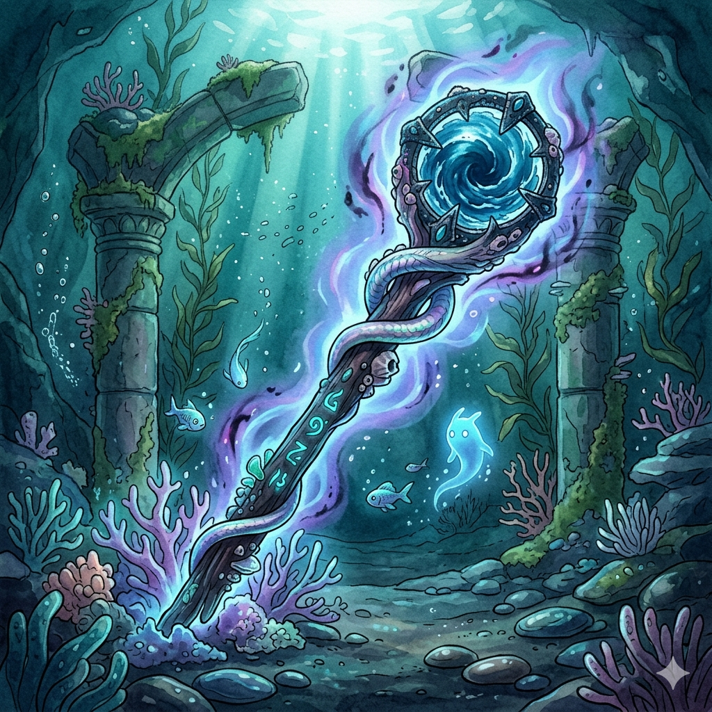
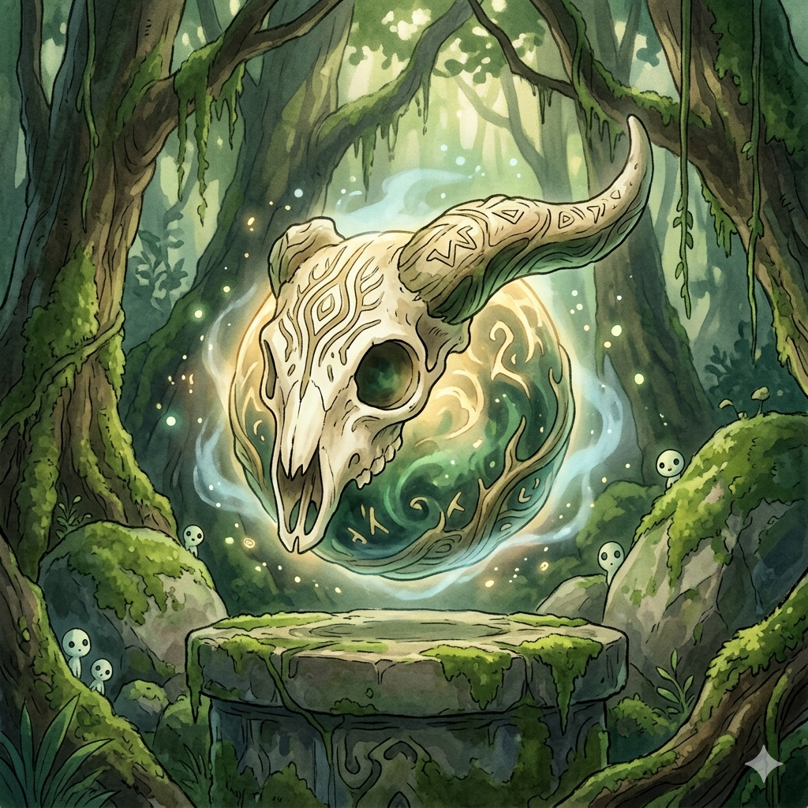
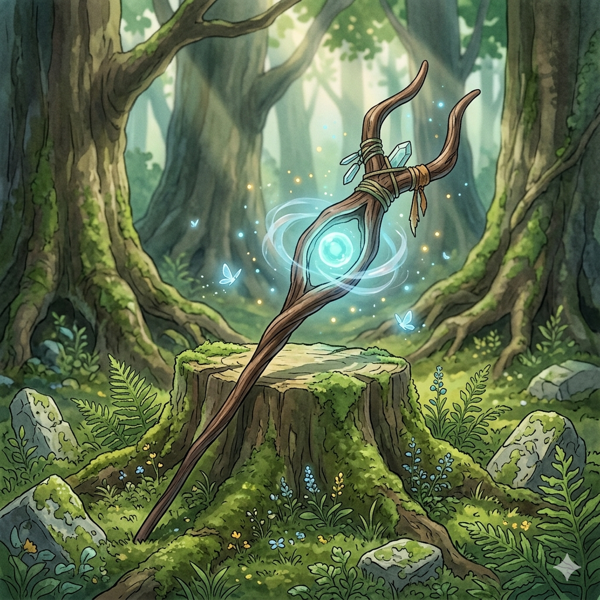
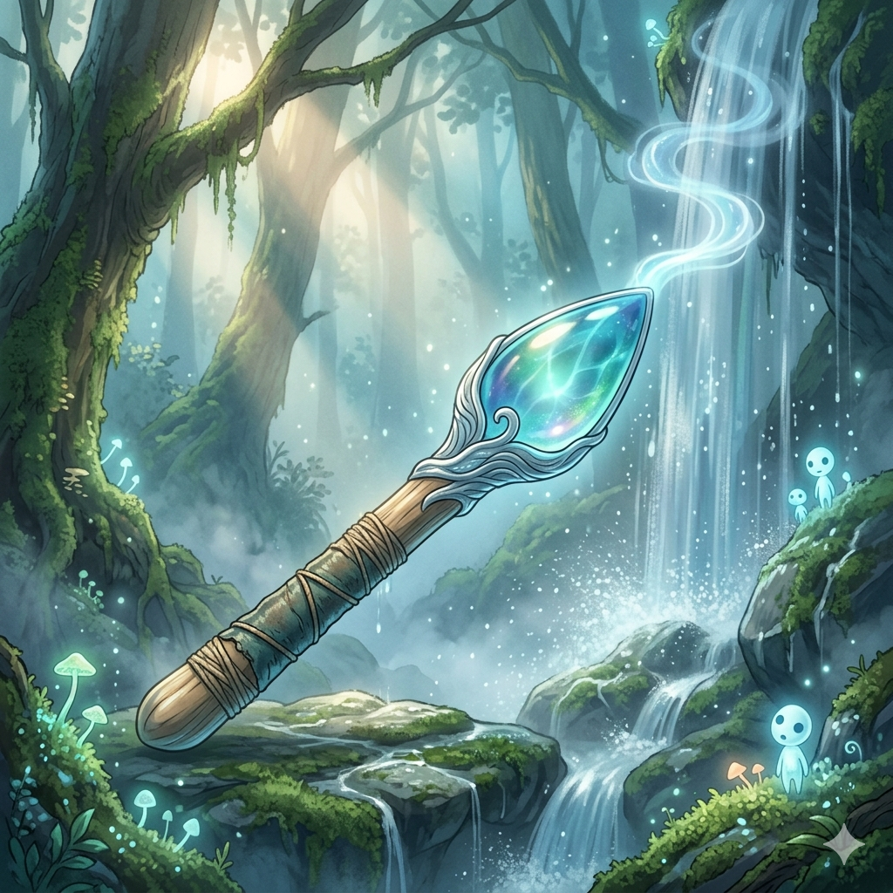
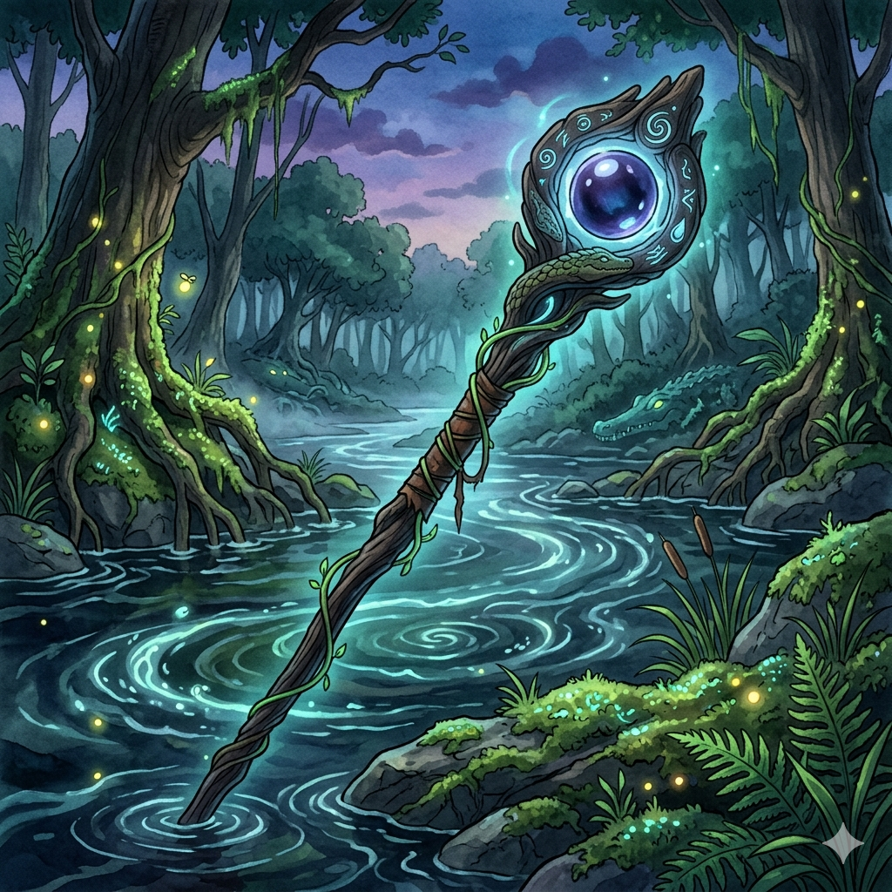
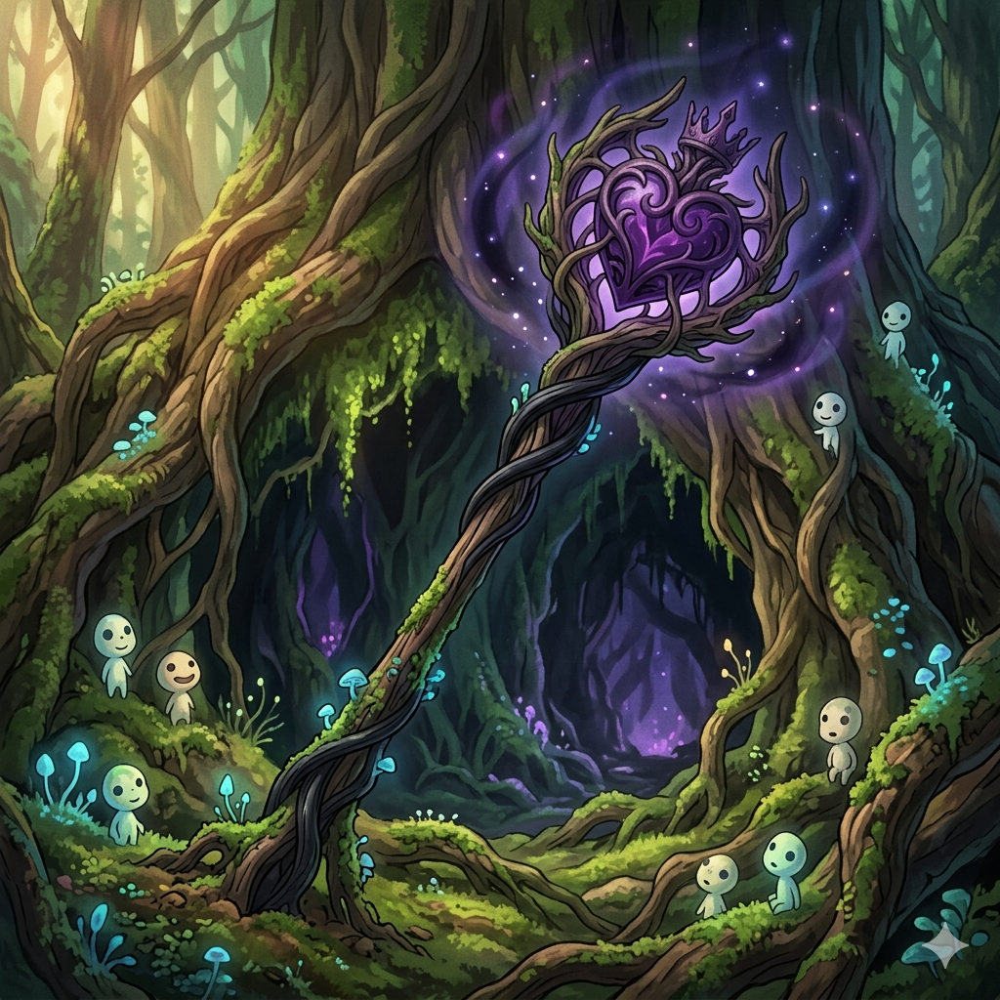
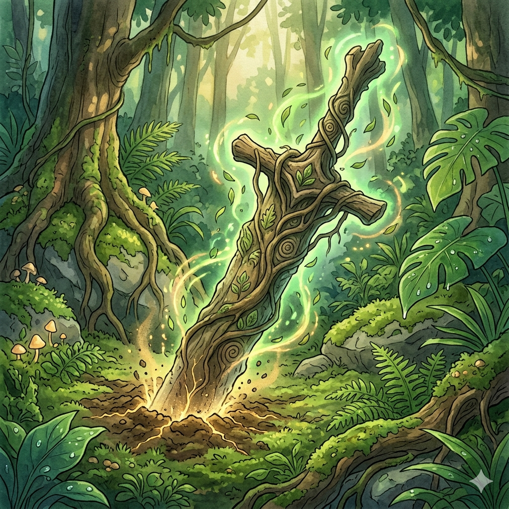
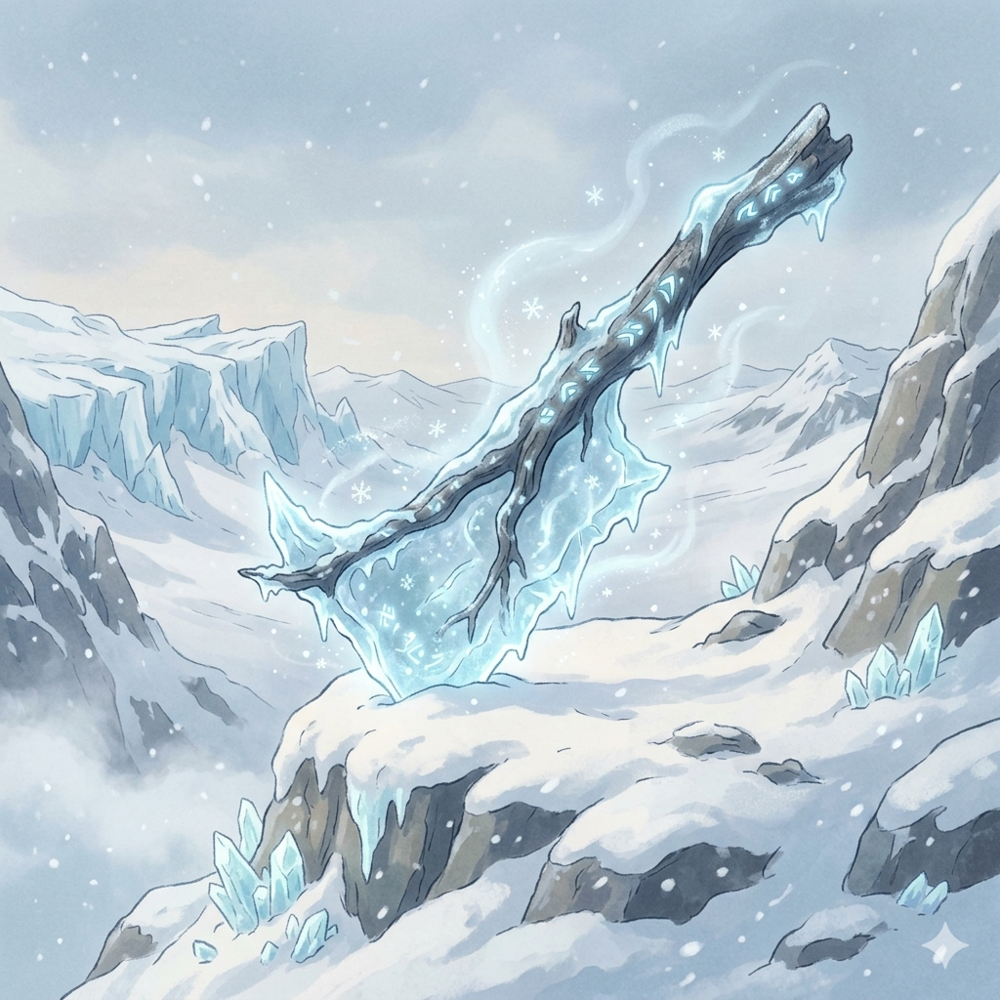

# Staff of Peloponesian Elemental Projection

Forged in an age when the boundaries between the mortal world and the elemental domains were still thin, the Staff of Peloponesian Elemental Projectination is said to have been crafted by a secluded circle of philosopher-artificers along the rugged coasts of the Peloponnese. These sages sought not dominion over nature, but harmony with its primal forces. They bound the essence of earth, water, light, and wind into a single conduit, using ancient rites performed at the confluence of river, sea, and stone. Each marking along the staff’s length represents a covenant—an agreement that the wielder must act as mediator, not conqueror, of the elements it commands.

Throughout history, the staff has passed silently between chosen bearers, often appearing in times of upheaval. Legends tell of a wanderer who struck the ground before an invading army, causing the earth itself to rise and scatter them without bloodshed. In drought-stricken lands, it was used to draw life-giving water from barren rock, though always sparingly, as if respecting an unseen balance. Sailors whispered prayers to its unseen presence, claiming sudden winds would carry them safely through storms when all hope seemed lost. Yet the staff does not answer recklessly—it responds only to those whose intentions align with the quiet equilibrium it was made to preserve.

Its most enigmatic power is tied to the dying light of day. By invoking the setting sun, the wielder captures a fragment of its departing radiance, forming a luminous sphere that defies darkness for half a day. Scholars debate whether this light is merely solar essence, or something deeper—a reflection of the cyclical nature of endings and renewal. The staff itself grows warm during this ritual, as though remembering every dusk it has ever witnessed.

Despite its immense power, the staff is not inexhaustible. Once each year, it must be returned to the flowing waters of a Peloponnesian river, where it rests submerged for a full day and night. During this time, it is believed the elements within it are reconciled and renewed, drawing from the land that first gave it purpose. Many who have sought to bypass this ritual found the staff growing inert, or worse, unresponsive in moments of dire need. For in its essence, the staff is not a weapon, but a pact—one that must be honored as faithfully as it is wielded.

# Tidebound Spine of Ael'Thyra

The Tidebound Spine of Ael’Thyra is believed to be the petrified remnant of a primordial sea-serpent that once coiled beneath the deepest trenches of a forgotten ocean. According to coastal myth, Ael’Thyra was not merely a creature, but a living current—an ancient will that shaped tides and whispered to storms. When it vanished, only fragments of its essence remained, carried ashore in the form of salt-scarred relics. Among them, this spine-like branch endured, still humming with the pulse of the abyss, as though the ocean itself had not yet released its claim upon it.

Those who wield the Spine often describe a strange sense of detachment from solid ground, as if their body begins to move with the rhythm of waves rather than their own intent. This phenomenon, known as the Echo of the Tides, grants an almost unnatural grace in motion—strikes bend, shift, and return like water against stone, making the wielder difficult to predict or contain. Yet this gift carries a subtle erosion of the mind. Thoughts begin to drift, focus slips, and over time, the line between intention and instinct dissolves into something deeper and less human.

The Spine’s true power reveals itself through the Abyssal Surge, a force that channels the crushing momentum of the deep sea into a single devastating release. With each invocation, the wave grows stronger, as though remembering its origin in the endless pressure of the ocean floor. However, this strength comes at a cost: a creeping corruption that seeps into both body and spirit. Veins may darken faintly, breath feels heavier, and a distant, wordless call begins to echo within the wielder’s thoughts—an invitation to descend, to surrender, to return.

Many who have bonded with the Tidebound Spine ultimately vanish near coastlines or are last seen walking calmly into the sea. Whether they are claimed by Ael’Thyra or transformed into something new remains unknown. What is certain is that the artifact does not merely grant power—it remembers its origin, and in time, it seeks to bring its bearer back into the depths from which it came.

# Skullhorn Relic

The Skullhorn Relic is whispered to have emerged from lands where life and death exist in an unbroken cycle, places where bones are not remnants, but seeds of memory. No forge ever shaped it, no artisan carved its form—rather, it is said to have grown over decades, perhaps centuries, from the remains of a long-forgotten beast whose spirit refused to fade. Wind, sun, and soil hardened its structure into something resembling the skull of an ancient horned creature, yet no known species matches its form. Those who study it closely claim the surface bears faint, shifting patterns, as if the relic still remembers the flesh that once surrounded it.

Its presence exerts an immediate, instinctive pressure on the living. Creatures of lesser will hesitate, their senses overwhelmed by something deeply primal—the unmistakable signal of death intertwined with enduring strength. This aura, known as the Primitive Presence, does not act through force, but through recognition. It speaks to something ancient in all beings, a buried understanding that the wielder stands in alignment with the oldest laws of nature: survival, decay, and return. In the hands of one attuned to it, the relic enhances not only magical power, but perception itself, sharpening awareness to a near instinctual clarity.

The Skullhorn Relic’s unique invocation, the “Call of Bones,” is less a spell and more a resonance. When awakened, it releases a silent wave that ripples through the surroundings, stirring fear in nearby foes as if they are being watched by unseen ancestors. At the same time, the wielder experiences a heightened state of perception—sounds grow sharper, movements clearer, and even the intentions of others seem momentarily exposed. Some describe this moment as standing between worlds, where the boundary between the living and the dead thins just enough to glimpse what lies beyond.

Despite its immense power, the relic resists ownership. It is often lost, only to reappear in the path of another who unknowingly meets its criteria. Many believe it is not an object, but a fragment of a greater, slumbering entity—one that observes the world through those who carry it. Others dismiss such claims, insisting it is nothing more than an unusually shaped branch. Yet few maintain that skepticism after holding it, for in that moment, there is an undeniable sensation: the feeling that something ancient has recognized you in return.

# Stigmata of the Redeemer

The Stigmata of the Redeemer is a sacred and fearsome relic, taking the form of a crown of thorns meant to be worn upon the head. Its twisted branches press firmly against the brow, drawing not only blood, but a silent vow from the one who bears it. Said to echo the suffering and sacrifice of a divine martyr, this crown is not an ornament, but a burden—one that binds the wearer to a higher calling. Those who place it upon their head often describe an immediate weight, not just physical, but spiritual, as if their thoughts are no longer entirely their own, but guided by something righteous and unyielding.

The power of the crown manifests first through restoration. Wounds close with unnatural speed, and even fatal injuries may be reversed, though never without cost. The wearer’s body becomes a vessel of relentless endurance, capable of rising again after death itself, as if granted a fragment of divine mercy. Yet each resurrection leaves a mark upon the soul—a deepening sense of solemn duty, and an awareness that such grace is not given freely, but expected to be repaid through unwavering purpose.

When invoked in times of great need, the Stigmata awakens its most awe-inspiring ability: Holy War. In this moment, the air trembles with unseen presence as a radiant archangel manifests, accompanied by soldiers of divine origin. They do not speak, nor do they linger beyond their purpose—they descend, execute judgment upon forces deemed unholy, and vanish like a passing storm of light. Witnesses often fall to their knees, not out of fear, but reverence, as if standing before something far beyond mortal comprehension.

Despite its holy nature, the crown does not choose lightly. It demands conviction, sacrifice, and a willingness to endure suffering without resentment. Those who attempt to wear it for power alone often find themselves overwhelmed—visions, guilt, and a crushing sense of accountability driving them to abandon it or perish beneath its weight. For the Stigmata of the Redeemer is not merely a relic of power, but a living testament to faith, sacrifice, and the unrelenting cost of redemption.

# The Hollow Sight

The Hollow Sight is an artifact of quiet intent, a staff that appears deceptively fragile—its aged wood worn thin, its structure marked by a distinct hollow ring near its upper length. Scholars and wanderers alike have long debated its origin, though most agree it was never crafted for war in the conventional sense. It is believed to have been shaped by a reclusive order of seers who valued perception above power, embedding within it a principle rather than a force: that true mastery lies not in overwhelming strength, but in flawless precision. From the moment one takes hold of it, there is a subtle shift—the sense that the staff is not empowering you, but aligning you.

In motion, the Hollow Sight resists brute handling. Its strikes carry little weight, instead flowing like a guided lash, rewarding timing and intent over raw force. Those who attempt to wield it aggressively often find themselves off-balance, as if the staff itself rejects such misuse. Its brittle appearance is no illusion; it offers little in the way of defense, and will not endure direct clashes for long. Instead, it urges constant movement, drawing its bearer into a rhythm of evasion and redirection. To stand still with it is to misunderstand it entirely.

Where the artifact reveals its true nature is in its relationship with mana. Rather than draining or demanding, it stabilizes. Energy flows through the wielder in a measured, almost guided current, as though the staff regulates the very act of casting. At the center of this phenomenon lies the hollow ring—a focal point that sharpens awareness and anchors intent. Through it, spells become unnervingly accurate, illusions gain structure and inevitability, and distant targets feel as though they are already within reach. It does not amplify chaos; it refines certainty.

Yet for all its elegance, the Hollow Sight carries an unspoken truth: it does not belong to anyone. Those who carry it often describe the sensation of being observed, subtly corrected, even judged. It appears rarely, and never without reason, passing between individuals who meet its silent criteria. In the end, it is less a weapon and more a guide—an instrument that chooses its bearer not to grant power, but to ensure that power is used with unwavering clarity.

# DeSoto’s Fallsight Wand

DeSoto’s Fallsight Wand is said to have formed not by human craft, but by the patient will of the falls themselves. Legends speak of a wandering hermit who meditated for decades beside a roaring cascade, seeking clarity beyond the limits of sight. When the hermit vanished, only a slender, water-worn twig remained, lodged between limestone and moss. It had absorbed the breath of the waterfall—the endless mist, the echoes, the shifting light—and awakened as something more than wood. Those who first discovered it noticed the air bending subtly around it, as if reality itself hesitated to keep secrets in its presence.

The wand does not favor the strong, but the observant. In the hands of a careless wielder, it is little more than a damp relic. But for those attuned to its quiet rhythm, it unveils the unseen: faint outlines shimmering in the mist, footsteps where none should be, paths hidden behind veils of illusion. It is said that near water, the wand hums softly, drawing strength from every ripple and current. Streams whisper to it, lakes reflect truths into it, and waterfalls awaken its fullest potential—turning its bearer into a watcher who cannot be deceived.

Many scouts and sentinels have sought the Fallsight Wand, though few truly understand its purpose. It does not grant dominance through force, but through awareness—the kind that turns ambush into opportunity. Its most feared ability, known as *Behind the Waterfall*, is described in old journals as a moment when the world sheds its disguises entirely. Illusions fracture, hidden enemies stand exposed, and even the intentions of foes seem briefly readable, as if the wielder glimpses the truth beneath motion itself.

Yet there is a quiet warning passed among those who have carried it too long. The wand does not merely reveal the world—it teaches its bearer to question what is seen. Over time, some claim they began to notice things others could not: figures in reflections, movements within stillness, truths that felt too vast to hold. Whether this is a gift or a burden remains uncertain, but one thing is clear—the Fallsight Wand ensures that ignorance, once lifted, can never fully return.

# Riverbound Warlock Staff

The Riverbound Warlock Staff is believed to have been shaped in the restless bends of a cursed river, where the current runs dark and creatures of the deep rule unseen. Its body, formed from gnarled driftwood, bears the marks of long submersion—scarred, polished, and hardened by relentless flow. At its crown rests a dense river stone, smooth yet unnervingly warm, said to have once been the heart of an ancient beast dragged beneath the waters. Warlocks who have studied it claim the staff does not merely channel magic—it listens to the pulse of the river and answers in kind, drawing power from the same unseen depths where predators wait in silence.

Unlike refined arcane focuses, this staff thrives in untamed environments. Near water, it awakens, its stone core dimly glowing as it absorbs the rhythm of the current. The air grows heavy, and enemies often report a creeping dread, as though something beneath the surface has marked them. This presence—known as the Predator’s Presence—is not an illusion, but a fragment of instinct embedded within the staff itself. It reminds all who face it that rivers are not gentle things, but forces that consume without warning. The wielder becomes an extension of that truth, striking not with precision alone, but with inevitability.

Its signature affliction, the Tidal Curse, is feared among those who have survived encounters with it. Victims describe a sensation of being pulled, as though invisible currents coil around their limbs, tightening with each spell cast against them. When the curse reaches its peak, movement ceases entirely, leaving the target momentarily claimed by the river’s will. In battle, this control pairs with bursts of stored energy from the stone core—violent surges released through *Abyss Pulse*, echoing like a submerged explosion that ripples outward with crushing force.

But the most unsettling power lies in the forbidden rite known as the *Crocodile Pact*. Through it, the warlock calls forth a spectral beast born from the river’s oldest memory—a predator that lunges with terrifying speed, jaws wide, embodying both hunger and judgment. Witnesses say the apparition is neither fully summoned nor fully imagined, but something in between, bound by the staff’s will. Those struck by it often speak of a final sensation before impact: the cold certainty that, in the domain of the river, nothing escapes forever.

# Mythic Heart of the Hollow Sovereign

The Heart of the Hollow Sovereign was not merely crafted but exhaled into existence during the twilight of a nameless era. Legend speaks of an ancient monarch who refused to surrender his spirit to the natural cycle of decay, choosing instead to merge his essence with the gnarled roots of the world's first forest. As the millennium passed, his physical form withered into a calcified wick of bone and dark timber, concentrating his absolute will into this singular staff. It acts as a conduit to a silent, subterranean kingdom where the laws of life and death are suspended by the weight of his lingering authority.

To grasp this relic is to accept a pact with the primordial void that dwells beneath the topsoil. The staff does not just vibrate with power; it demands a synchronization of the soul, pulling the wielder into a rhythmic, haunting cadence that mirrors the Sovereign's ancient pulse. As the weapon draws upon the shadows of the hollow earth, it exerts a gravitational influence over the battlefield, bending the resolve of enemies and shielding the bearer behind a veil of absolute nothingness. It is a tool of cold, calculated dominance, ensuring that any who stand against the wielder are eventually crushed by the same crushing pressure that formed the Heart itself.

In the hands of the worthy, the staff becomes a scepter of inevitable conquest, manifesting the Sovereign's Grasp upon the living. The dark energy woven into its grain reacts to the heat of combat, growing more oppressive with every spell cast until the air itself feels heavy with the scent of damp earth and old ozone. When the wielder calls upon the Heartquake, they are not merely attacking; they are commanding the world to remember its true master. The forest may be silent now, but the Heart serves as a reminder that the Sovereign’s reign was never truly abdicated, only waiting for a hand strong enough to reclaim the throne.

# Dogfather

The Dogfather is a relic forged in the savage crucible of the Miocene Epoch, carved from the fossilized remains of a mountain peak that had been smoothed by the tongues of a thousand ancestral packs. It carries the weight of a prehistoric dynasty, specifically the Epicyon Haydeni, whose reign was defined by the literal crushing of primordial bone and the absolute unity of the wild. The club-staff resonates with a deep, territorial vibration that pulses through the ground, serving as a beacon to any creature sharing the bloodline of the wolf or the hound. It is not merely a weapon but a totem of pack leadership, vibrating with a primal energy that commands the landscape and bends the elements to the will of the alpha.

Wielding this artifact grants one access to the collective memory of the bone crushers, infusing the bearer with a ferocity that defies modern limits. When held near the edge of a river or the mist of a ravine, the Dogfather draws upon the ancient moisture of the earth to drench opponents in a paralyzing chill, asserting dominance over the very environment. Its presence on the battlefield shifts the tide of war through sheer psychological pressure and physical empowerment, restoring the jagged edges of allied weaponry and mending the weary spirits of those who follow its lead. To hold the Dogfather is to hold the leash of nature itself, calling forth a loyal army from the horizon to defend the honor of the pack.

The true power of the artifact lies in its ability to awaken the dormant, primal strength hidden within the soul of its user. By invoking the spirits of the ancient canine kings, the wielder undergoes a terrifying transformation of presence, bolstering the defenses and striking power of every ally within sight. This legendary relic ensures that the hierarchy of the wild is respected, rewarding the faithful with unparalleled luck and devastating precision. As long as the Dogfather is raised, the echoes of the mountain ravines remain loud, ensuring that the legacy of the Haydeni kings never fades and that the strength of the canine heart remains unmatched in the annals of history.

# Lawin

The Lawin is a relic of soaring defiance, its blade forged from a celestial ore that fell into the dense archipelagic jungles during a time of shifting shadows. In the 1600s, it became the extension of a legendary warrior from Cebu, a champion whose name was erased from the scrolls but whose deeds remained etched in the scars of the earth. Under the command of a forgotten Datu, this greatsword was the final line of defense against an invading civilization that arrived with strange technology and iron hearts. The sword does not merely cut through armor; it slices through the very fabric of the wind, mimicking the predatory grace of the hawk for which it was named.

The disappearance of the warrior and the blade into the depths of the Philippine wilderness turned the Lawin into a living myth, a dormant force waiting for a hand worthy of its heavy burden. It acts as a spiritual lightning rod, capable of siphoning the raw, untamed aura from the surrounding flora and fauna to fuel its devastating edge. Those who have attempted to track the sword speak of a forest that seems to breathe in rhythm with the steel, where the air grows heavy with static and the ground trembles at the mere approach of a seeker. It is said that the blade is not lost, but rather presiding over the land it once protected, hidden by the roots and the mist of centuries.

When the Lawin is finally unsheathed, the atmosphere fractures under the weight of its concentrated power. A single downward strike does not just end a life; it disrupts the tectonic plates themselves, channeling the stored energy of the nature aura into a localized earthquake that shatters the resolve of entire armies. The weapon possesses a terrifying precision, boasting a critical lethality that ensures no foe survives a direct confrontation. To wield the Lawin is to inherit the duty of the Cebuano champion, becoming a sentinel of the islands who commands the fury of the earth and the boundless spirit of the sky.

# Frostbite Cleaver

The Frostbite Cleaver is a testament to frozen endurance, birthed from a single resilient branch that refused to snap during the apocalyptic Night of a Thousand Winds. As the world splintered under the pressure of the gale, an eternal blizzard descended upon the wood, flash-freezing the sap into a crystalline edge that remains harder than tempered steel. It is a relic of the Sixth Glacier, carrying within its grain the absolute zero of a storm that has been raging in isolation for eons. The weapon does not just radiate cold; it anchors the concept of winter itself to the physical plane, ensuring its blade never dulls and its bite never thaws.

History remembers the tool not in the hands of a conqueror, but gripped by the Hermit of Hollow Ridge, a figure of solitude who navigated the impassable whiteouts of the high peaks. For the Hermit, the cleaver was a key rather than a sword, used to cleave through solid walls of gale and ice that would have pulverized any mortal traveler. By swinging the heavy, rime-covered blade, he could part the most violent tempests, creating a wake of unnatural stillness in the heart of the vortex. Its passive aura, known as Winters Whisper, serves as a psychic chill that numbs the fighting spirit of adversaries, convincing their very souls that the season of life has come to a permanent end.

However, the power of the Sixth Glacier comes with a harrowing price for those who seek to master its frigid weight. The cleaver acts as a heat sink for the mind, slowly siphoning away the warmth of emotion and the fire of ambition until only a cold, analytical void remains. Prolonged exposure to the relic causes the wielders thoughts to crystallize and slow, mirroring the glacial pace of the ancient mountain. While it provides unparalleled resistance to the elements and devastating cryo potency, one must be wary of the silence it brings; for many, the path carved through the storm leads to a destination where they can no longer feel the sun.